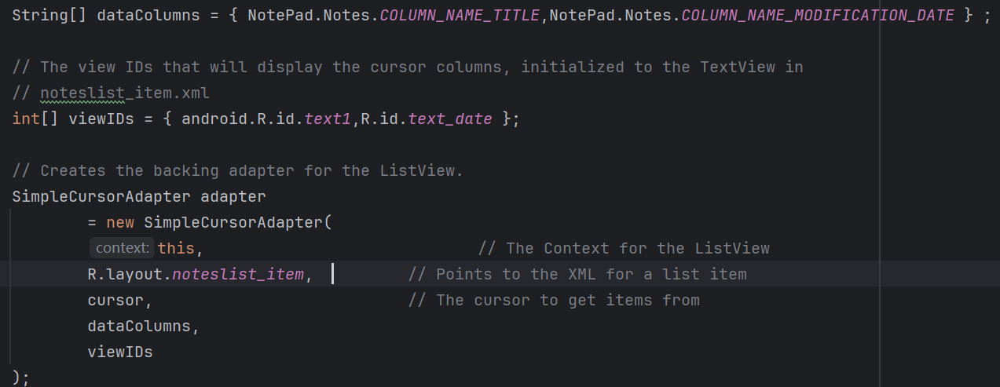
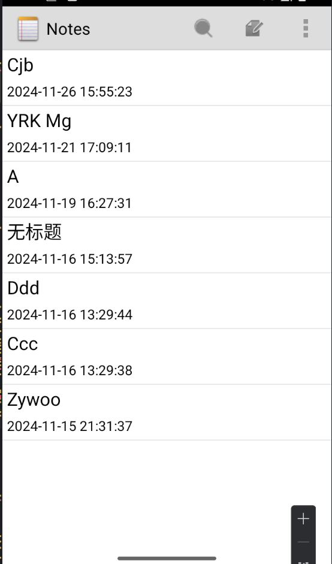
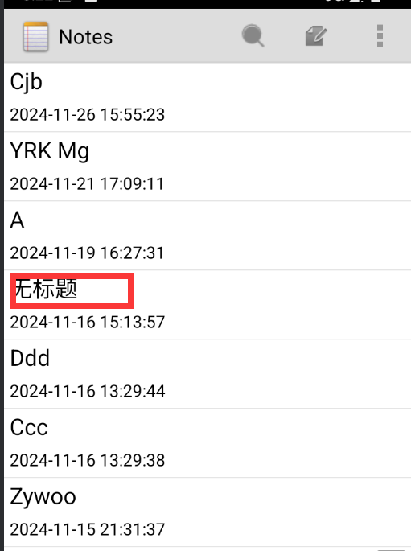

# NotePad
### 基本要求

#### 时间戳

完成效果：


如何实现：

首先布局文件修改，通过线性布局设置两个textview控件


更新日记的时候存入对应的时间


然后再notelist里面调用，添加对应属性列





#### 搜索功能

首先再menu文件下添加搜索的按钮


对应效果


添加对于这个搜索的点击事件，点击搜索跳到搜索页面


这是搜索页面布局文件的代码

```
<?xml version="1.0" encoding="utf-8"?>
<LinearLayout xmlns:android="http://schemas.android.com/apk/res/android"
    xmlns:app="http://schemas.android.com/apk/res-auto"
    android:orientation="horizontal"
    android:layout_width="match_parent"
    android:layout_height="match_parent"
    android:paddingLeft="5dp"
    android:paddingTop="10dp"
    android:paddingRight="5dp"
    android:background="#ddd"
    android:weightSum="1">


    <LinearLayout
        android:id="@+id/search_ctn"
        android:layout_width="1dp"
        android:layout_weight="0.85"
        android:layout_height="50dp"
        android:background="@drawable/border_radius"
        android:weightSum="1">

        <ImageView
            android:id="@+id/search_logo"
            android:src="@drawable/search"
            android:layout_width="40dp"
            android:layout_height="40dp"
            android:layout_gravity="center_vertical"
            />

        <EditText
            android:id="@+id/note_search"
            android:layout_width="match_parent"
            android:layout_height="40dp"
            android:textSize="20dp"
            android:hint="请输入"
            android:textColor="#333"
            android:focusable="true"
            android:singleLine="true"
            android:background="@android:color/transparent"
            android:gravity="center_vertical"
            android:layout_gravity="center_vertical"/>
<!--android:background="@android:color/transparent"可以去掉下划线-->


    </LinearLayout>


    <TextView
        android:id="@+id/note_cancel"
        android:layout_width="1dp"
        android:layout_weight="0.15"
        android:layout_height="50dp"
        android:text="取消"
        android:textSize="20dp"
        android:textColor="#0000ff"
        android:gravity="center"/>


</LinearLayout>
```

最后搜索页面的效果


这边写搜索rk然后点击搜索按钮，就会跳回list页面

结果(显示两条是因为我Cjb标题的内容下包含了rk)


代码实现：

首先获取搜索的关键词


根据搜索关键词查询


### 附加功能

#### 排序

通过menu设置四个排序（默认、时间升序，标题降序，标题升序）

实现：


菜单对应点击，通过getNoteList函数传入sort排序规则，


这里设置排序规则从而产生效果

效果图：

时间默认：


时间升序：


标题降序：


标题升序：


#### 字体大小

通过menu设置三种字体大小


自定义updateFontSize函数修改每个list对应的标题和时间戳的大小


对应效果图：

默认：


大：


小：


#### 主题切换

通过menu设置两种主题（默认的黑色，以及白色）


通过saveThemePreference函数保存对应的主题


然后使用setTheme来设置

效果展示：

默认黑色：


白色：




#### 重置

通过menu设置重置按钮来实现对于搜索关键词的清空，以及对于字体重置为默认


#### 细节优化

原本的note笔记当我们没有对它设置标题的时候或者是空字符串的时候会显示空，导致不美观，所以我通过判断这个标题，如果是上述情况则标题显示为无标题。

代码实现：


效果：

原先的：


修改后：


